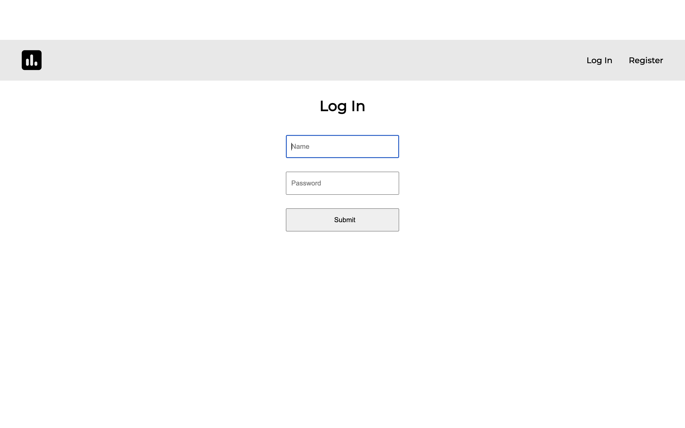
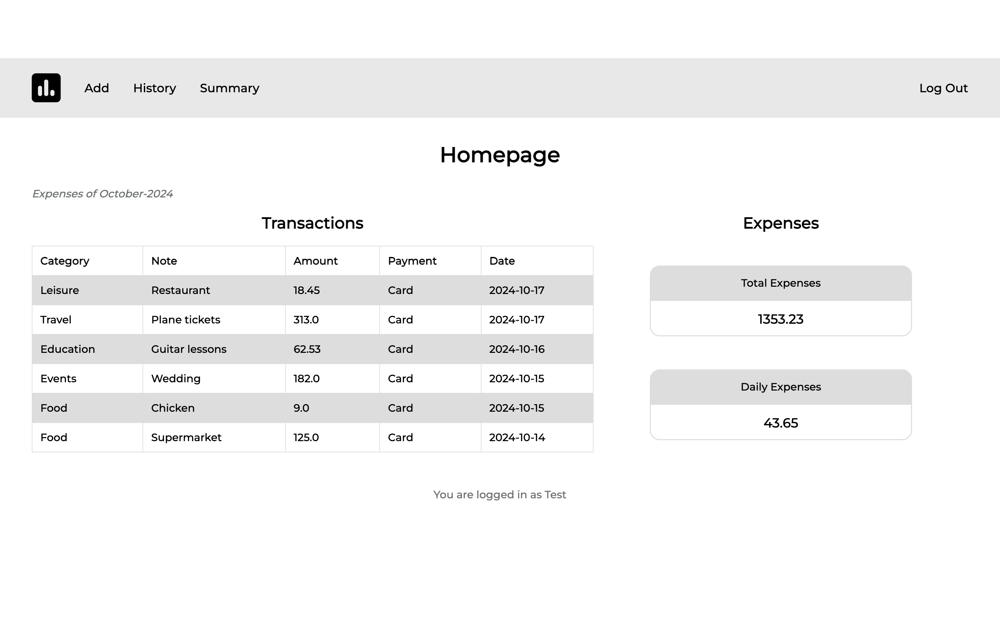
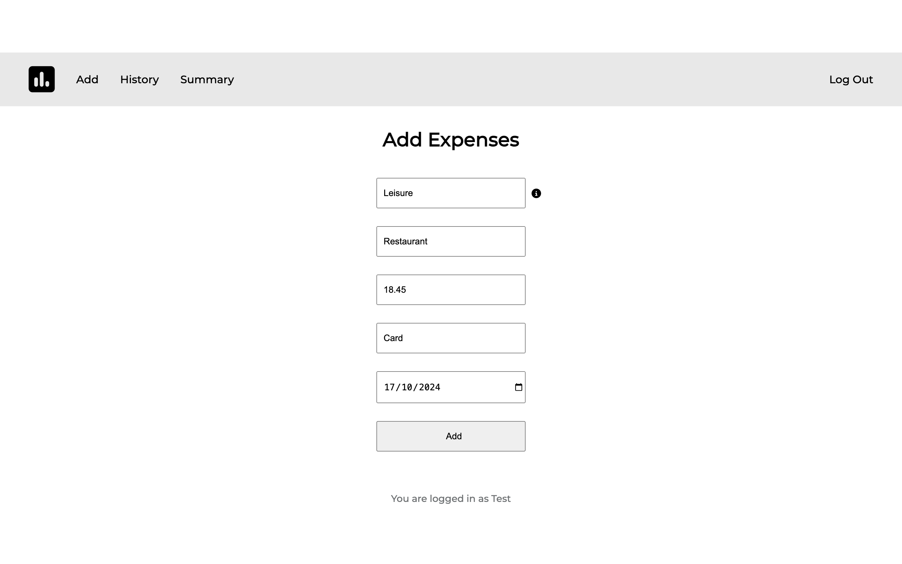
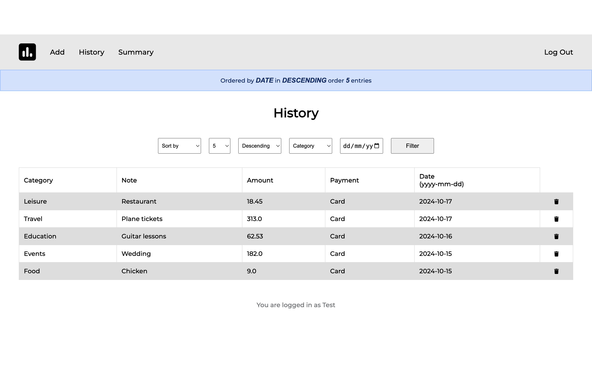
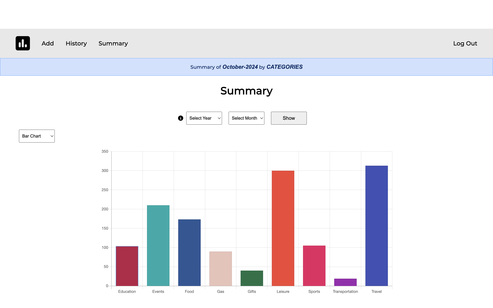
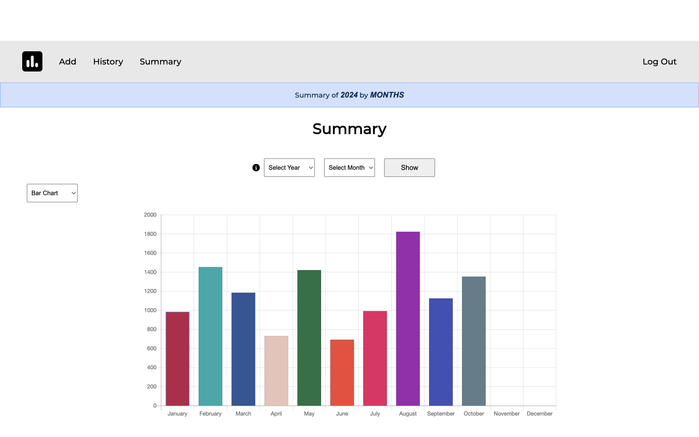
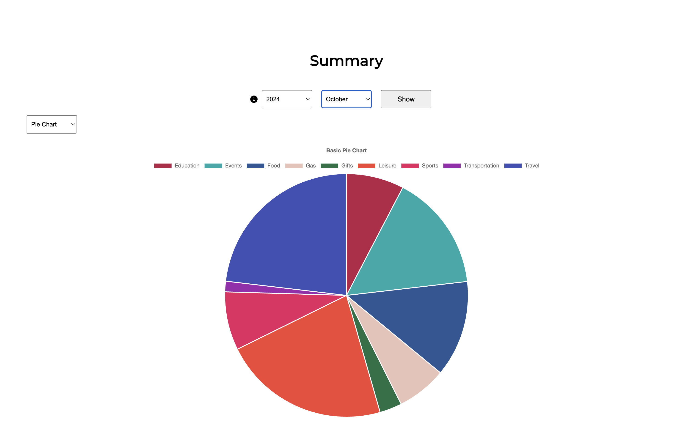

# Expense Tracker
#### Video Demo:  <URL HERE>[URL HERE]

Expense Tracker is a web application that allows users to manage their personal finances by tracking expenses, categorizing them, and visualizing spending through charts. It helps users monitor their budget, analyze spending habits, and gain insights into their financial behavior.

## Features
- User registration and login system
- Login required decorator to protect certain routes
- Add expenses by category, date, amount and payment method
- View summaries of expenses by categories during a specific month or by month during a specific year
- Visualize spending with pie charts and bar graphs
- Search and filter expenses by category, date, amount or payment method
- Responsive design for mobile devices
- Simple database integration using SQLite

## Technologies Used
- Python (Flask) for backend server and routing
- SQLite for storing a database with user data and expenses
- phpLiteAdmin for database management
- HTML/CSS/JavaScript for frontend 
- Chart.js for data visualization (pie charts and bar graphs)
- Flask-Session for session management
- Jinja2 for templating in HTML files

## Usage
1. Register for a new account or log in with existing credentials



2. Visualize the 6 most recent expenses for the current month in the homepage table



3. Check the total amount of expenses and the daily average of the current month
4. Add expenses by entering the category, note (optional), amount, payment method and date



5. View a detailed history of your expenses and filter them by date, category, amount and payment method



6. Search for expenses by setting its specific date and/or category in the history section
7. Set the number of entries that should be displayed and the order (descending or ascending) in your query
8. Delete expenses by clicking on the garbage icon next to the entry from the history page
9. Visualize a bar(column) chart or pie chart in the summary section



10. Monthly & Yearly Summaries:
    - By default, a bar graph displays the current month's expenses by category
    - Select a specific month and year to see a breakdown for that period
    - Select only the year to visualize yearly expenses, categorized by month



11. Alternate between the bar chart and the pie chart by using the dropdown menu  



12. Logging out clears session data and redirects the user to the login route

## Installation

1. Clone the repository:
    ```bash
    git clone https://github.com/ChemaRapariz/expense-tracker.git
    ```
2. Navigate to the project directory:
    ```bash
    cd expense-tracker
    ```
3. Create a virtual environment:
    ```bash
    python3 -m venv venv
    ```
4. Activate the virtual environment:

    On macOS/Linux:
    ```bash
    source venv/bin/activate
    ```

    On Windows:
    ```bash
    venv\Scripts\activate
    ```
5. Install the required dependencies:
    ```bash
    pip install -r requirements.txt
    ```
6. Run the application:
    ```bash
    flask run
    ```

7. Access the app in your browser at `http://127.0.0.1:5000/`
8. To manage the SQLite database, consider using ***phpLiteAdmin*** located at /phpliteadmin-dev/phpliteadmin.php. Configure it by updating `phpliteadmin.php` or `phpliteadmin.config.sample.php`

## Design Choices

### phpLiteAdmin 
This web-based SQLite database admin tool written in PHP supports SQLite3, has no installation required and is simply dropped into a directory on a server and then visited in a browser, making it really convenient. It allowed me to easily view the data and modify entries if needed. 

### filesystem as Flask session storage type
I opted to store session data on the filesystem rather than in cookies, as it provides better security. Cookies can be manipulated by clients, whereas filesystem storage keeps session data server-side. It is used to check if the user is logged via the login_required decorator in `helpers.py`. Moreover, `session['user_id']` is included in multiple queries across `app.py` to map the expense to the user.

### ` get_db()` function in `helpers.py`
`get_db()` checks if there is already a database connection in Flask's g object. If not, it creates one and reuses it for the duration of the request. It avoids reusing closed connections, ensures that the connections are managed efficiently and prevents conflicts between multiple threads.

### Chart.js library 
Chart.js makes it possible to create dynamic and interactive charts. The process begins by fetching relevant data from the backend, which is then passed to the JavaScript frontend in `summary.html`. Chart.js utilizes this data to render both pie and bar charts, offering users an engaging and clear way to understand their expense summaries. 

## Contributing
Contributions are welcome! Please open an issue or submit a pull request for any improvements or features you'd like to add.

## License
This project is licensed under the MIT License - see the LICENSE file for more information.
